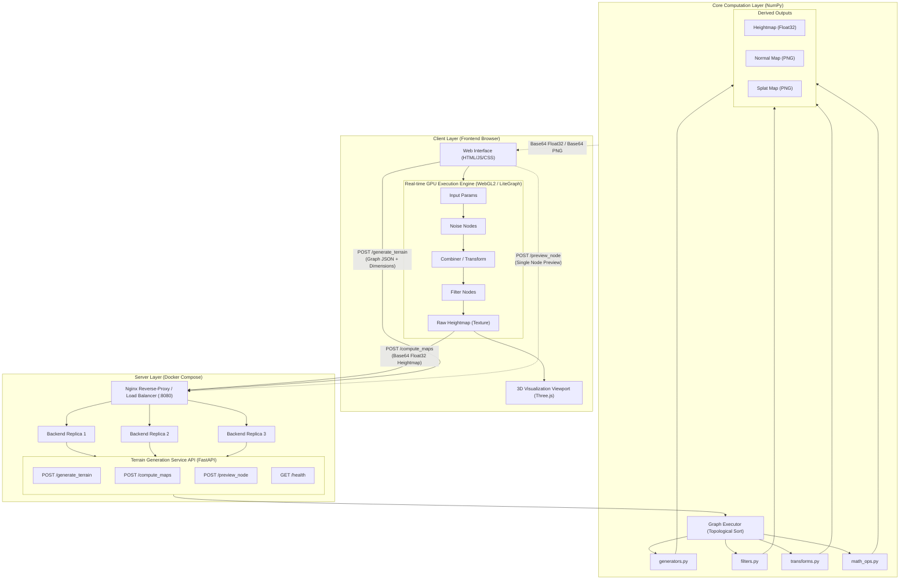

# Noise & TerrainGen

Noise & TerrainGen is a free web-based graph editor for creating procedural textures, generating heightmaps, and experimenting with generative noise functions. 


## Architecture

Noise & TerrainGen uses a Service-Oriented Architecture (SOA) splitting real-time preview computation to the user's GPU, and heavy export/derivation tasks to the Python backend:



## Local Setup

To run Noise & TerrainGen locally, you'll need to start both the frontend static site server and the Python backend API server.

### 1. Start the Backend API Server

The backend requires Python 3 and the dependencies listed in `requirements.txt`.

**Option A — Direct (single instance, no load balancer):**

```bash
cd server
pip install -r requirements.txt
uvicorn main:app --host 0.0.0.0 --port 8080 --reload
```

**Option B — Docker Compose (3 replicas + Nginx load balancer):**

Requires [Docker Desktop](https://www.docker.com/products/docker-desktop/) (free).

```bash
docker compose up --build
```

This spins up 3 FastAPI backend workers behind an Nginx reverse-proxy, all on `localhost:8080`. Round-robin load balancing is automatic.

The API will now be listening on `http://localhost:8080`.

### 2. Start the Frontend Server

You can serve the root directory using any simple HTTP web server. For example, using Python's built-in HTTP server:

```bash
# In the root of the repository (where index.html is located)
python -m http.server 8000
```

Once running, visit `http://localhost:8000` in your web browser.

## Features
- Visual node-based graph editor for terrain and noise generation.
- Real-time 3D Terrain visualizer view using three.js.
- Export to multiple 2D map formats (Heightmap, Normal Map, Splat Map).
- High performance map execution by offloading $O(N^2)$ computations to the FastAPI backend.

## Running Experiments

Noise & TerrainGen includes a rigorous command-line benchmarking and statistical validation suite used for research, notably testing the Wave-Harmonic terrain generation algorithm against standard baselines (raw noise, fBm, thermal erosion).

### Quick Smoke Test

To verify the experimental pipeline and generate a quick demonstration at 256×256 resolution:

```bash
python run_experiment.py --quick
```

### Full Benchmark Suite

To run the complete paired-comparison framework (4 spatial resolutions from 256 to 1024, 50 distinct base seeds, 50 performance samples per pipeline), simply run:

```bash
python run_experiment.py
```

### Output

The runner will automatically isolate and save all results to a new timestamped directory under `experiment_results/run_YYYYMMDD_HHMMSS/` containing:
- `experiment_report.txt` — Human-readable tables of parameters, latency, memory, throughput, structural indices, and p-values.
- `metrics.json` — Exhaustive structural and performance analysis for programmatic integration.
- `node_parameters.json` — A direct mapping to reproduce the tested algorithmic phases in the graphical graph editor.
- `figures/` — Matplotlib visualisations (heightmap comparisons, power spectral density log-log plots, latency/throughput comparisons, and roughness differentials).
- `heightmaps/` — Raw Float32 `.npy` cache of generated arrays.
