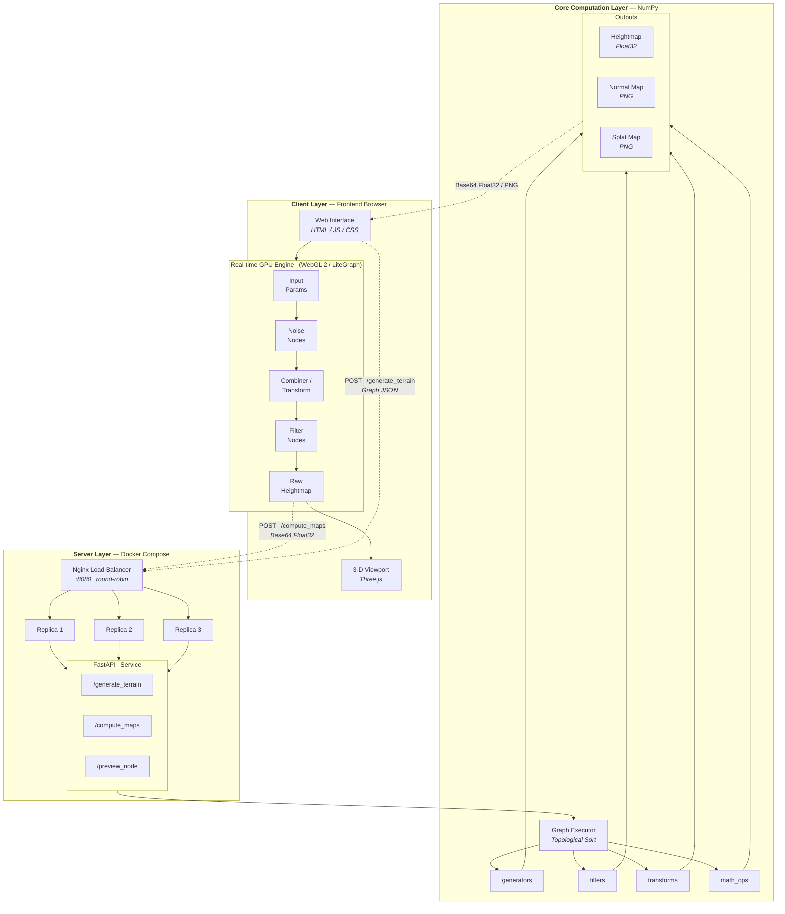
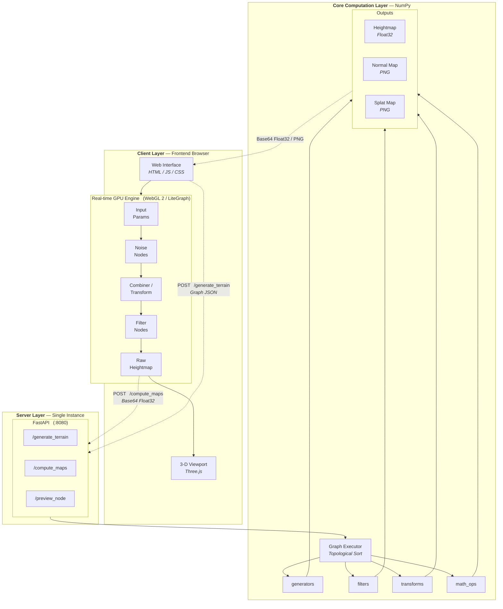
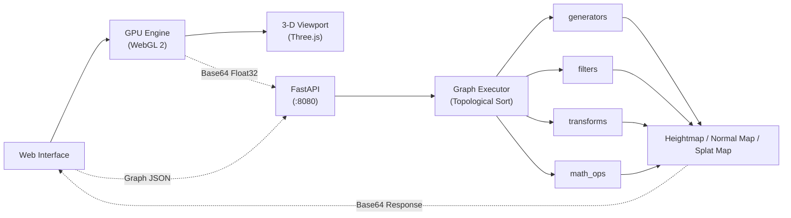

# System Architecture — Paper Figure

Compact Mermaid diagram suitable for academic paper inclusion.  
Render with [Mermaid Live Editor](https://mermaid.live) or `mmdc` CLI → export as SVG/PNG.

---

## Single-Instance Architecture (No Docker)

Simplified view without the load-balancer / replica layer — a single FastAPI process serves all requests directly.

---

## Compact Architecture

Minimal version for tight paper layouts.

